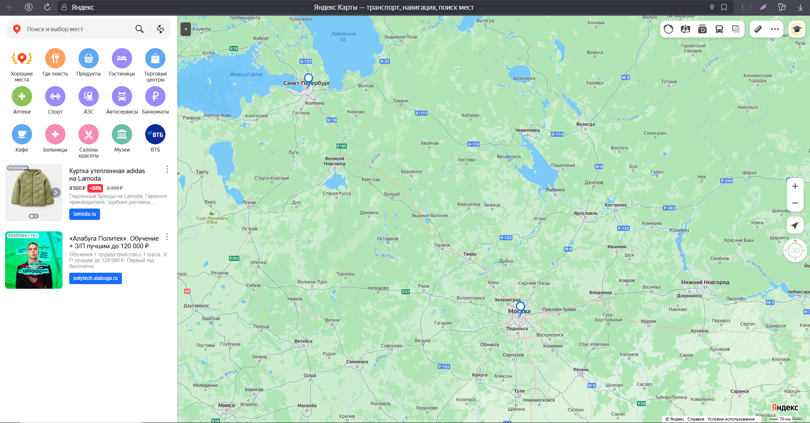
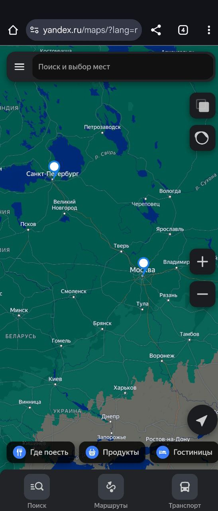

Отлично! Я могу оформить весь текст в единый `README.md` в том же стиле, что и предыдущий раздел.
Вот как будет выглядеть полный вариант с добавлением предложенного 8-го пункта:

````markdown
# Yandex Map Generator

Скрипт для генерации URL и отображения меток на Яндекс.Картах на основе JSON с координатами.

---

## 1. Описание

Скрипт принимает список точек в формате JSON и открывает карту Яндекс с метками.  
Каждая точка должна содержать следующие поля:

- `id` — идентификатор точки (обязательное поле)  
- `latitude` — широта (обязательное поле)  
- `longitude` — долгота (обязательное поле)  
- `title` — название точки (необязательное поле)

Пример JSON:  
```json
[
    {"id": 1, "latitude": 55.75, "longitude": 37.61},
    {"id": 2, "latitude": 59.93, "longitude": 30.33, "title": "Санкт-Петербург"}
]
````

---

## 2. Установка

Клонировать репозиторий или скачать скрипт `script.py`.

Создать виртуальное окружение и активировать его:

```bash
python -m venv .venv
.venv\Scripts\activate  # Windows
# или
source .venv/bin/activate  # Linux / macOS
```

При наличии зависимостей установить их:

```bash
pip install -r requirements.txt
```

---

## 3. Использование

### 3.1 Передача JSON как строки

```bash
python script.py "[{\"id\": 1, \"latitude\": 55.75, \"longitude\": 37.61}]"
```

На Windows нужно экранировать кавычки.

### 3.2 Передача JSON через stdin

```bash
echo '[{"id": 1, "latitude": 55.75, "longitude": 37.61}]' | python script2.py
```

Или через файл:

```powershell
Get-Content points.json | python script.py --stdin  # Windows PowerShell
cat points.json | python script.py --stdin         # Linux / macOS
```

### 3.3 Передача JSON из файла

```bash
python script2.py points.json
```

Скрипт автоматически определяет тип входных данных.

---

## 4. Логирование

* После активации скрипт автоматически переносит пользователь по ссылке на карту

Скрипт выводит в консоль:

* Информацию о загруженных точках
* URL карты Яндекс
* Ошибки парсинга JSON

Пример вывода:

```
2025-08-21 01:09:30,101 - INFO - Загружено 2 точек
2025-08-21 01:09:30,101 - INFO - URL: https://maps.yandex.ru/?ll=37.6173%2C55.7558&z=5&lang=ru_RU&pt=37.6173%2C55.7558%2Cpmwtm1~30.3351%2C59.9343%2Cpmwtm2
2025-08-21 01:09:30,359 - INFO - Карта открыта.
```

---

## 5. Требования

* Python 3.10+
* Интернет для открытия карты в браузере
* Стандартные модули: `argparse`, `json`, `logging`, `webbrowser`

---

## 6. Особенности

* Автоматическое определение входных данных: JSON-строка или файл
* Поддержка чтения через stdin
* Возможность редактировать масштаб карты (`zoom`) и язык (`lang`) в классе `YandexMapGenerator`

---

## 7. Пример рабочего варианта

Файл `points.json`:

```json
[
    {"id": 1, "latitude": 55.75, "longitude": 37.61},
    {"id": 2, "latitude": 59.93, "longitude": 30.33, "title": "Санкт-Петербург"}
]
```

Запуск:

```bash
python script2.py points.json
```

Консольный вывод:

```
2025-08-21 01:09:30,101 - INFO - Загружено 2 точек
2025-08-21 01:09:30,101 - INFO - URL: https://maps.yandex.ru/?ll=37.6173%2C55.7558&z=5&lang=ru_RU&pt=37.6173%2C55.7558%2Cpmwtm1~30.3351%2C59.9343%2Cpmwtm2
2025-08-21 01:09:30,359 - INFO - Карта открыта.
```

В браузере откроется карта с двумя метками: Москва и Санкт-Петербург.

---

## 8. Советы по тестированию JSON

* Для проверки скрипта можно создать любой JSON с координатами.
* Каждая точка должна содержать хотя бы поля `id`, `latitude` и `longitude`.
* Рекомендуется использовать валидаторы JSON, чтобы убедиться, что формат корректный.
* Можно проверять передачу данных через все три способа: строка, stdin и файл.
* Проверяйте экранирование кавычек на Windows при передаче строки через командную строку.
* При переходе по URL на мобильных устройствах следует открывать её в браузере иначе может быть некорректное отображение точек из-за особенности мобильного приложения карт.


## 9. Пример реализации

Ниже показан пример работы скрипта на двух устройствах, где видно, что точки успешно отображаются на карте.

### 9.1 Скриншот на устройстве 1

  
*На карте видны две метки: Москва и Санкт-Петербург. Скрипт корректно сгенерировал URL и открыл карту.*

### 9.2 Скриншот на устройстве 2

  
*На другом устройстве те же точки отображаются корректно. Это подтверждает работоспособность скрипта на разных системах.*

